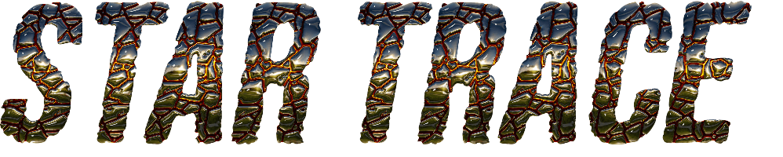

StarTrace is a Graph Neural Net (GNN) trained on 1000s of [PeTar](https://github.com/lwang-astro/PeTar) N-body simulations to trace the formation history and initial substructure of star clusters. It takes the kinematic data of an evolved star cluster and predicts whether it formed monolithically, from a bimodal merger, or from hierarchical assembly of subclusters. StarTrace is also a package for building initial conditions for subclustered N-body simulations. The GNN was built with [PyTorch-geometric](https://pytorch-geometric.readthedocs.io/en/latest/). 


```
StarTrace/
├── predict.py            # Generic template for predictions from txt file data
├── gaia_dr3.py           # Predictions for the Hunt & Reffert 2023 catalog of Gaia DR3 sources
├── model/
    ├── StarTrace.py          # Core library (all classes and utilities)
    ├── train.py              # Training CLI
    ├── validate.py           # Validation CLI
```

# Predict

The CLIs for using the trained StarTrace model to predict cluster histories can be found in ```predict.py, gaia_dr3.py```. The CLI for generic data (a simple text file of positions & velocities) can be found in ```predict/predict.py```.  

A file for extracting and classifying star clusters with full 6D phase space information from the Gaia DR3 ([Hunt & Reffert 2023](https://cdsarc.cds.unistra.fr/viz-bin/cat/J/A+A/673/A114#/article)) can be found in ```predict/gaia_dr3.py```. 


# Train

The CLI for training your own data, assuming PeTar simulations, can be found in ```model/train.py```. Example usage:
```
# Basic training 
python train.py --data_path /path/to/sims/

# Train with automatic validation
python train.py --data_path /path/to/sims/ --validate

# Customize hyperparameters
python train.py --data_path /path/to/sims/ --n_classes 4 --hidden_dim 256

# Use different snapshot and k-NN settings
python train.py --data_path /path/to/sims/ --snapshot 10 --k_neighbors 64
```

# Simulate

```simulate/generate_ics.py```

Creates initial conditions for N-body simulations consisting of N particles
in N\_sc subclusters, each in a plummer distribution. The user can set the 
virial parameter of the subclusters and the system as a whole. The subclusters
are also set up with a coherent velocity towards the system center of mass.

#### Usage

To set up simulations, start with ```simulate/make_suite.py```. Example bash scripts for making a large suite of simulations (```setup_sims.sh```) and running them in parallel on a supercomputer (```submit_jobs.sh```) can be found in ```simulate/scripts/```.

#### Example
The following code creates a star cluster with 1000 stars and 3 subclusters, with a radius of 10 pc. The stellar density of the subclusters is 1000 $\rm M_\odot/pc^3$, and the virial ratios of the entire cluster and the individual subclusters are 0.4 and 0.1, respectively. 

```
sc = SubClusters(
    num_total=1000,
    num_subclusters=3,
    radius=10,
    subcluster_rho=1000,
    subcluster_virial_ratio=0.1, 
    global_virial_ratio=0.4,
    seed=0
)
``` 

#### Note on running petar

The ```SubClusters``` creates a plain text file (```ics.txt```) of initial conditions. To convert this to PeTar format, after installing PeTar run:

```
petar.init ics.txt
```

Then you can run with:

```
petar -u 1 -r 0.1 ics.txt.input
```
where ```-u 1``` sets the units to $\rm M_\odot,\, pc,\, Myr$ and ```-r 0.1``` sets the outer changeover radius to $0.1~\rm pc$. For more information, see the PeTar documentation.
